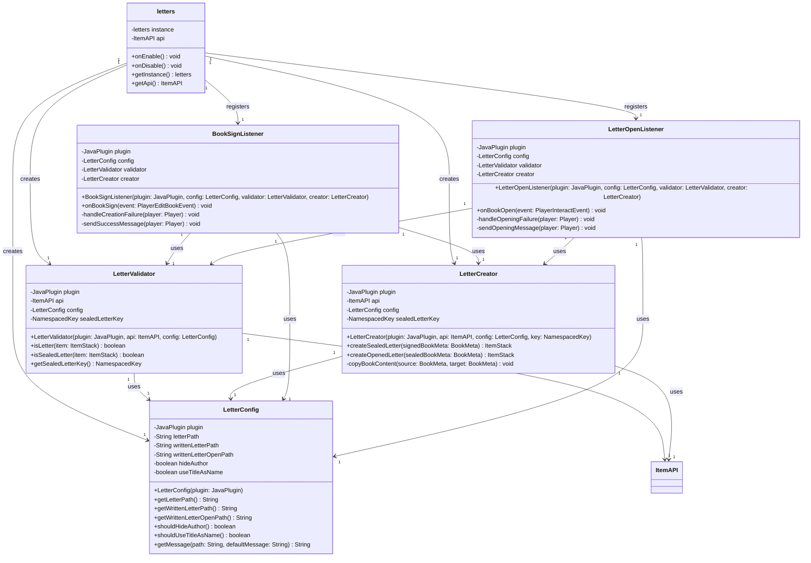

# Letters

A Minecraft Paper plugin that allows players to write and seal letters using custom writable book items, with a visual seal-breaking effect when opened.

## Features

- Write letters using special **Letter** items (writable books)
- Sign letters to seal them. Tthe texture changes to show a sealed **Written Letter**
- Open sealed letters to break the seal. The texture changes to show an **Opened Letter**
- Configurable item paths via TLibs/MMOItems/ItemsAdder
- Customizable messages for signing and opening letters
- Optional author name hiding in tooltips
- Use book titles as item display names

## Architecture

The plugin follows a modular architecture with clear separation of concerns:



*View the [UML source file](UML-Diagram.mmd) for editing*

## Dependencies

| Dependency | Required |
|---|---|
| [Paper](https://papermc.io/) 1.21+ | Yes |
| [TLibs](https://www.spigotmc.org/resources/tlibs.127713/) | Yes |
| [MMOItems](https://www.spigotmc.org/resources/mmoitems-premium.39267/) | No |
| [ItemsAdder](https://itemsadder.com/) | No |

## Installation

1. Place `Letters.jar` into your server's `plugins/` folder
2. Make sure that **TLibs** is also installed. **MMOItems** and **ItemsAdder** are optional
3. Reload the server or Enable `letters-1.0.0` with PlugManX
4. Configure `plugins/Letters/config.yml` as needed

## Configuration

```yaml
# Item paths (from MMOItems or ItemsAdder via TLibs)
items:
  letter: "m.books.letter"                             # Unsigned writable book item
  written-letter: "m.books.written_letter"             # Sealed letter (signed, unopened)
  written-letter-open: "m.books.written_letter_open"   # Opened letter (broken seal)
  
  # Vanilla item example: "v.iron_ingot"
  # ItemsAdder item example: "ia.tfmc:written_letter"

# Messages sent to players
# Supports hex colors with &#RRGGBB
messages:
  letter-signed: "&aYou have successfully signed your letter!"
  letter-opened: "&7The seal breaks as you open the letter..."
  letter-creation-failed: "&cFailed to create letter. Please make a ticket."
  letter-open-failed: "&cFailed to open letter. Please make a ticket."

# Feature settings
settings:
  hide-author: true         # Whether to hide the author name ("by PlayerName") in tooltips
  use-title-as-name: true   # Whether to use the book's title as the item's display name
                            # (e.g., "Peace Treaty" instead of "Sealed Letter")
```

### Configuration Options

| Key | Default | Description |
|---|---|---|
| `items.letter` | `m.books.letter` | Item path for unsigned writable book |
| `items.written-letter` | `m.books.written_letter` | Item path for sealed letter (signed) |
| `items.written-letter-open` | `m.books.written_letter_open` | Item path for opened letter |
| `messages.letter-signed` | Success message | Message shown when signing a letter |
| `messages.letter-opened` | Seal break message | Message shown when opening a sealed letter |
| `messages.letter-creation-failed` | Error message | Message if letter creation fails |
| `messages.letter-open-failed` | Error message | Message if letter opening fails |
| `settings.hide-author` | `true` | Hide author name in book tooltips |
| `settings.use-title-as-name` | `true` | Use book title as item display name |

## Usage

1. **Writing a Letter**: Right-click with a Letter item (writable book) and write your message
2. **Signing the Letter**: Click "Sign" when finished. The letter will transform into a sealed Written Letter
3. **Opening a Letter**: Right-click with a sealed Written Letter to break the seal and read it. It becomes a Written Letter (Open)

## Author

Justin - TFMC
[Donation Link](https://www.patreon.com/c/TFMCRP)
